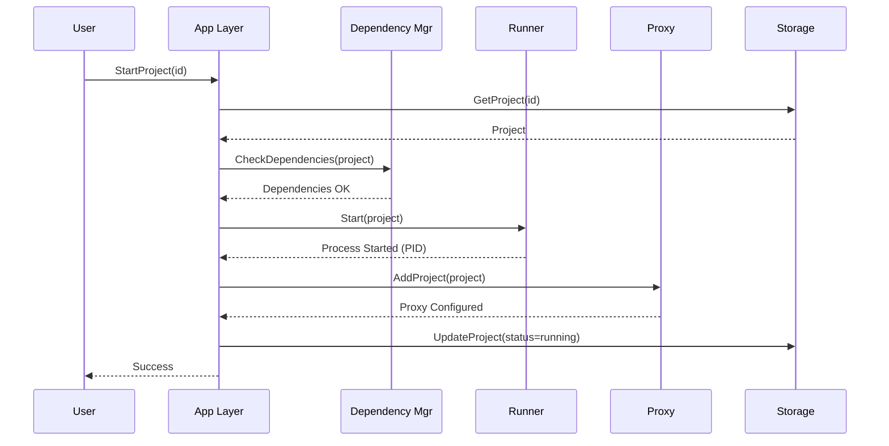

# Arquitetura do SofredorOrchestrator

## Visão Geral

O **SofredorOrchestrator** é uma ferramenta de orquestração de desenvolvimento local que permite gerenciar múltiplos projetos simultaneamente, utilizando uma arquitetura modular e extensível.

## Componentes Principais

### 1. Backend (Go)

#### Config Layer (`internal/config/`)
- **Responsabilidade:** Gerenciamento de configuração em camadas
- **Deep Merge:** Configuração remota (upstream) + configuração local (override)
- **Zero Secrets:** Nenhuma credencial hardcoded
- **Formato:** YAML

```
Remote Config (Empresa)
        ↓
  [Deep Merge]
        ↓
Local Config Override
        ↓
   Config Final
```

#### Domain Layer (`internal/domain/`)
- **Entidades:**
  - `Project`: Representa um projeto gerenciado
  - `Manifest`: Parser do arquivo `sofredor.yaml`
  - `Dependency`: Dependências de runtime

#### Runner Layer (`internal/runner/`)
- **Pattern:** Strategy Pattern
- **Runners Disponíveis:**
  - `NativeRunner`: Executa processos nativos do SO
  - `DockerRunner`: Gerencia containers Docker (futuro)

```go
interface ProjectRunner {
    Start(ctx, project) error
    Stop(ctx, projectID) error
    Status(projectID) (*RunnerStatus, error)
    GetLogs(projectID, tail) ([]LogEntry, error)
}
```

**Fluxo de Execução:**
```
User Action → App Layer → Factory → Runner → Process/Container
```

#### Dependency Manager (`internal/dependency/`)
- **Checkers Específicos:**
  - Node.js: Verifica versão via `node -v`
  - Python: Verifica versão via `python --version`
  - PostgreSQL: Verifica instalação

- **Instalação Automática (Planejado):**
  - Download de binários portáteis
  - Armazenamento em `~/.sofredor/deps/`
  - Sem poluição do sistema global

#### Proxy Manager (`internal/proxy/`)
- **Traefik Manager:**
  - Gera configuração dinâmica
  - Roteia `*.sofredor.local` para portas dos projetos
  
- **Hosts Manager:**
  - Manipula `/etc/hosts` (ou equivalente Windows)
  - Adiciona entradas `127.0.0.1 projeto.sofredor.local`

#### Storage Layer (`internal/storage/`)
- **Database:** SQLite
- **Localização:** `~/.sofredor/data/orchestrator.db`
- **Tabelas:**
  - `projects`: Estado dos projetos
  - `logs`: Logs de execução
  - `dependencies`: Cache de dependências

### 2. Frontend (React + TypeScript)

#### Componentes Principais

```
App.tsx
├── ProjectCard.tsx
│   ├── StatusBadge.tsx
│   └── DependencyAlert.tsx
└── LogsViewer.tsx
```

#### Comunicação com Backend
- **Wails Bindings:** Chamadas diretas Go ↔ JavaScript
- **API Service:** Wrapper TypeScript tipado
- **Hooks:** `useProjects()` para state management

### 3. Fluxo de Dados

```
┌─────────────┐
│   Frontend  │
│   (React)   │
└──────┬──────┘
       │ Wails Bindings
┌──────▼──────┐
│  App Layer  │
│   (Go)      │
└──────┬──────┘
       │
   ┌───┴────┬──────────┬─────────┐
   ▼        ▼          ▼         ▼
Config   Runner   Dependency  Storage
 Loader  Factory   Manager      DB
```

## Decisões Arquiteturais

### 1. Por que Strategy Pattern para Runners?
- **Extensibilidade:** Adicionar novos runners (Podman, systemd) sem modificar código existente
- **Testabilidade:** Mock runners facilmente em testes
- **Separação de Concerns:** Lógica de execução isolada

### 2. Por que SQLite?
- **Zero Configuration:** Não requer servidor externo
- **Cross-Platform:** Funciona em Linux, Mac, Windows
- **Suficiente:** Para dados locais, SQLite é mais que adequado
- **Backup Simples:** Um único arquivo `.db`

### 3. Por que Traefik?
- **Configuração Dinâmica:** Atualização sem restart
- **File Provider:** Simples de integrar via YAML
- **Maturidade:** Projeto consolidado e bem documentado

### 4. Configuração em Camadas (Remote + Local)
- **Padronização Corporativa:** Empresa define configuração upstream
- **Flexibilidade Individual:** Dev pode sobrescrever localmente
- **Git-Friendly:** `config.local.yaml` no `.gitignore`

## Diagramas

### Arquitetura de Sistema

```mermaid
graph TD
    A[GUI - React] -->|Wails| B[App Layer]
    B --> C[Config Loader]
    B --> D[Runner Factory]
    B --> E[Dependency Manager]
    B --> F[Storage]
    
    D --> G[Native Runner]
    D --> H[Docker Runner]
    
    G -->|spawn| I[OS Process]
    H -->|SDK| J[Docker Container]
    
    E --> K[Node Checker]
    E --> L[Python Checker]
    
    B --> M[Traefik Manager]
    B --> N[Hosts Manager]
    
    M -->|config| O[Traefik Process]
    N -->|write| P[/etc/hosts]
```

### Fluxo de Start Project



## Extensões Futuras

### Plugins System
- Interface `Plugin` com hooks
- Carregamento dinâmico via Go plugins
- Exemplos: Custom runners, checkers, notificadores

### Docker Runner Completo
- Usar `github.com/docker/docker/client`
- Gerar `docker-compose.yml` dinâmico
- Gerenciar networks e volumes

### Instaladores Automáticos
- Download e instalação de Node.js portable
- Python standalone distributions
- Verificação de checksum SHA256

## Performance

### Otimizações Implementadas
- **Connection Pooling:** SQLite com max 25 conexões
- **Log Buffer:** Últimas 1000 linhas em memória
- **Context Cancelation:** Cleanup gracioso de recursos

### Benchmarks Esperados
- Startup: < 2s
- Start Project: < 5s
- Stop Project: < 2s
- UI Rendering: 60 FPS

## Segurança

### Princípios
1. **Zero Secrets Hardcoded:** Apenas em `config.local.yaml` (gitignored)
2. **Privilégios Mínimos:** Alerta quando requer sudo
3. **Isolamento:** Processos em sandboxes quando possível
4. **Validação:** Input validation em todos os endpoints

### Ameaças Mitigadas
- **Code Injection:** Validação de comandos
- **Path Traversal:** Canonicalização de paths
- **Resource Exhaustion:** Limites de memória e CPU (futuro)
